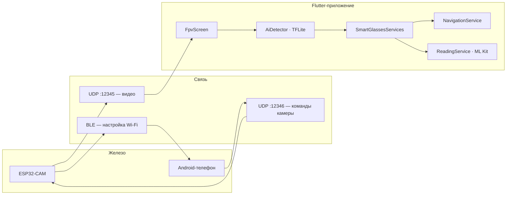

# Glaza — Smart Glasses AI

<p align="center">
  <strong>Мобильное приложение для умных очков с компьютерным зрением, голосовым управлением и офлайн-навигацией</strong>
</p>

<p align="center">
  Flutter · ESP32-CAM · YOLO / TFLite · Speech-to-Text · TTS · OpenStreetMap
</p>

<p align="center">
  
  
  
  
</p>

---

## О проекте

**Glaza** — это companion-приложение для DIY-умных очков на базе ESP32-CAM. Телефон принимает видеопоток по Wi-Fi, запускает нейросеть в реальном времени и озвучивает окружение: препятствия, светофоры, дорожные знаки, текст на этикетках и голосовые подсказки маршрута.

Проект ориентирован на **доступность**: голосовые режимы, стерео-радар, виброотклик и офлайн-карты помогают ориентироваться в городе без постоянного взгляда на экран.

---

## Возможности

| Режим | Что делает |
|-------|------------|
| **Стандартный** | YOLO-детекция объектов, анализ светофоров и знаков, озвучивание окружения |
| **Навигация** | Голосовой ввод адреса, маршрут по OSRM, пошаговые подсказки на русском |
| **Радар** | Стерео-бипы: частота и канал зависят от близости и положения объекта в кадре |
| **Чтение** | OCR этикеток (ML Kit), цены, состав, предупреждения об аллергенах |

### Дополнительно

- **FPV-поток** с ESP32 по UDP (порт `12345`) с фрагментацией кадров
- **Настройка через BLE** — передача Wi-Fi SSID/пароля на очки
- **Офлайн-карты** — скачивание и кэширование тайлов OpenStreetMap
- **Карта осведомлённости** — предупреждения о препятствиях рядом (Overpass API + GPS)
- **Приоритетная очередь TTS** — голосовые сообщения не перебивают друг друга
- **Прошивка ESP32** — исходник в `lib/main.cpp` (Wi-Fi, BLE, UDP-видео)

---

## Архитектура



---

## Быстрый старт

### Требования

- Flutter SDK **3.10+** ([установка](https://docs.flutter.dev/get-started/install))
- Android-устройство с Bluetooth, GPS, микрофоном
- ESP32-CAM с прошивкой из `lib/main.cpp`
- Модель `assets/models/best.tflite` (~10 MB, уже в репозитории)

### Установка

```bash
git clone https://github.com/AlexMikhin951/glaza-app.git
cd glaza-app
flutter pub get
flutter run
```

### Первый запуск

1. Включите Bluetooth и разрешите доступ к геолокации и микрофону.
2. На экране настройки укажите **SSID и пароль Wi-Fi** (или режим hotspot).
3. Нажмите **Старт** — приложение найдёт ESP32 по BLE и передаст настройки.
4. После подключения откроется FPV-экран с видео и AI-оверлеем.

### Голосовые команды

| Команда | Действие |
|---------|----------|
| «навигация» | Режим маршрута |
| «чтение» | OCR этикетки |
| «радар» | Стерео-радар препятствий |
| «стандартный» | Обычный режим |
| «какой режим» | Текущий режим |
| «веди до …» / «маршрут до …» | Построить маршрут (в режиме навигации) |

---

## Структура проекта

```
glaza_app/
├── lib/
│   ├── main.dart                 # Точка входа
│   ├── setup_screen.dart         # BLE + Wi-Fi настройка
│   ├── fpv_screen.dart           # FPV, карта, голосовой UI
│   ├── smart_glasses_services.dart
│   ├── ai_detector.dart          # TFLite YOLO
│   ├── navigation_service.dart   # OSRM + геокодинг
│   ├── reading_service.dart      # OCR + аллергены
│   ├── radar_service.dart        # Стерео-бипы
│   ├── traffic_light_analyzer.dart
│   ├── road_sign_analyzer.dart
│   ├── map_awareness_service.dart
│   └── main.cpp                  # Прошивка ESP32-CAM
├── assets/
│   └── models/
│       ├── best.tflite
│       └── labels.txt
├── android/ · ios/ · ...
└── pubspec.yaml
```

---

## Прошивка ESP32

Исходник прошивки: [`lib/main.cpp`](lib/main.cpp).

| Параметр | Значение |
|----------|----------|
| UDP видео | порт **12345** |
| UDP команды | порт **12346** |
| Настройка | BLE GATT + JSON (SSID, пароль, IP телефона) |

Соберите и прошейте через **PlatformIO** или **ESP-IDF**, указав конфигурацию камеры под ваш модуль ESP32-CAM.

---

## Стек технологий

| Категория | Библиотеки |
|-----------|------------|
| UI | Flutter, Material 3 |
| CV / ML | `tflite_flutter`, `ultralytics_yolo`, `google_mlkit_text_recognition` |
| Голос | `speech_to_text`, `flutter_tts` |
| Связь | `flutter_blue_plus`, UDP sockets |
| Карты | `flutter_map`, `geolocator`, `flutter_compass` |
| Прочее | `just_audio`, `vibration`, `shared_preferences` |

---

## Разрешения Android

Приложение запрашивает: Bluetooth, геолокацию (в т.ч. фоновую для навигации), микрофон, камеру (для ML Kit), сеть.

---

## Сборка релиза

```bash
flutter build apk --release
# APK: build/app/outputs/flutter-apk/app-release.apk
```
