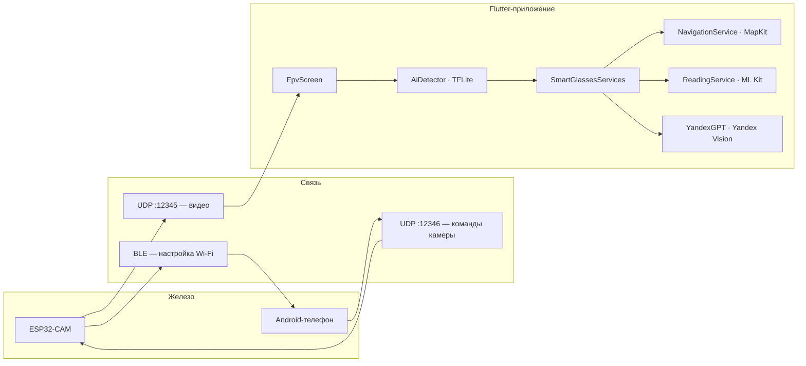

# Glaza — Smart Glasses AI

<p align="center">
  <strong>Companion-приложение для DIY-умных очков: FPV, YOLO, голосовая навигация, OCR и офлайн-карты</strong>
</p>

<p align="center">
  Flutter · ESP32-CAM · YOLO / TFLite · Yandex MapKit · Speech-to-Text · TTS
</p>

<p align="center">
  
  
  
  
  
</p>

---


| Экран | Описание |
|-------|----------|
| **Настройка** | BLE-подключение к ESP32, ввод Wi-Fi / hotspot, сохранение избранных мест |
| **FPV + AI** | Видеопоток с очков, YOLO-оверлей, светофоры, знаки, HUD с FPS |
| **Навигация** | Яндекс.Карты, пешеходный маршрут, пошаговые голосовые подсказки |

> Скриншоты — UI-мокапы на основе текущего дизайна приложения.

---

## Скачать

| Способ | Ссылка |
|--------|--------|
| **APK (релиз v1.0.0)** | [Releases](https://github.com/AlexMikhin951/glaza-app/releases/latest) |
| **Сборка из исходников** | см. [Быстрый старт](#быстрый-старт) |

---

## О проекте

**Glaza** — мобильное приложение для умных очков на базе ESP32-CAM. Телефон принимает видеопоток по Wi-Fi, запускает нейросеть в реальном времени и **озвучивает окружение**: препятствия, светофоры, дорожные знаки, текст на этикетках и голосовые подсказки маршрута.

Проект ориентирован на **доступность** — голосовые режимы, стерео-радар, виброотклик и офлайн-карты помогают ориентироваться в городе без постоянного взгляда на экран.

---

## Возможности

### Режимы работы

| Режим | Команда | Что делает |
|-------|---------|------------|
| **Улица** | «улица» / «стандартный» | YOLO-детекция, светофоры, знаки, карта осведомлённости |
| **Дом** | «дом» | Препятствия и радар в помещении, без уличной карты |
| **Навигация** | «навигация» | Голосовой ввод адреса, маршрут Яндекс.Карт, пошаговые подсказки |
| **Чтение** | «чтение» / «прочитай» | OCR этикеток (ML Kit), цены, аллергены |
| **Радар** | «радар» | Стерео-бипы: частота и канал зависят от близости объекта |
| **Поиск** | «найди человека» | Поиск и озвучивание объектов в кадре |
| **Идентификация** | «какой цвет» / «штрихкод» | Цвет, освещённость, купюры, штрихкоды |
| **Сцена** | «что передо мной» | Описание сцены через YandexGPT |

### Дополнительно

- **FPV-поток** с ESP32 по UDP (порт `12345`) с фрагментацией кадров
- **Настройка через BLE** — передача Wi-Fi SSID/пароля на очки
- **Яндекс.Карты** — пешеходная навигация, поиск, геокодинг
- **Офлайн-карты** — скачивание и кэширование тайлов OpenStreetMap
- **Карта осведомлённости** — предупреждения о препятствиях (Overpass API + GPS)
- **SOS** — экстренный вызов с геолокацией
- **Soundscape** — звуковой слой карты для ориентации
- **Приоритетная очередь TTS** — голосовые сообщения не перебивают друг друга
- **Прошивка ESP32** — исходник в [`firmware/main.cpp`](firmware/main.cpp)

---

## Архитектура


```mermaid
flowchart LR
    subgraph Hardware["Железо"]
        ESP["ESP32-CAM"]
        Phone["Android-телефон"]
    end

    subgraph Transport["Связь"]
        BLE["BLE — настройка Wi-Fi"]
        UDP["UDP :12345 — видео"]
        CMD["UDP :12346 — команды камеры"]
    end

    subgraph App["Flutter-приложение"]
        FPV["FpvScreen"]
        AI["AiDetector · TFLite"]
        SVC["SmartGlassesServices"]
        NAV["NavigationService · MapKit"]
        OCR["ReadingService · ML Kit"]
        CLOUD["YandexGPT · Yandex Vision"]
    end

    ESP --> BLE --> Phone
    ESP --> UDP --> FPV
    Phone --> CMD --> ESP
    FPV --> AI --> SVC
    SVC --> NAV
    SVC --> OCR
    SVC --> CLOUD
```

---

## Быстрый старт

### Требования

- Flutter SDK **3.10+** ([установка](https://docs.flutter.dev/get-started/install))
- Android-устройство с Bluetooth, GPS, микрофоном
- ESP32-CAM с прошивкой из [`firmware/main.cpp`](firmware/main.cpp)
- Модель `assets/models/best.tflite` (~10 MB, в репозитории)
- API-ключ [Yandex MapKit](https://developer.tech.yandex.ru/services/) (для навигации)

### Установка

```bash
git clone https://github.com/AlexMikhin951/glaza-app.git
cd glaza-app
flutter pub get

# Скопируйте шаблон ключа и вставьте свой MapKit API key
cp lib/mapkit_api_key.dart.example lib/mapkit_api_key.dart

flutter run
```

Или передайте ключ при запуске:

```bash
flutter run --dart-define=MAPKIT_API_KEY=ваш_ключ
```

### Первый запуск

1. Включите Bluetooth и разрешите доступ к геолокации и микрофону.
2. На экране настройки укажите **SSID и пароль Wi-Fi** (или режим hotspot).
3. Нажмите **Старт** — приложение найдёт ESP32 по BLE и передаст настройки.
4. После подключения откроется FPV-экран с видео и AI-оверлеем.

### Голосовые команды

| Команда | Действие |
|---------|----------|
| «навигация» | Режим маршрута |
| «чтение» / «прочитай» | OCR этикетки |
| «радар» | Стерео-радар препятствий |
| «улица» / «стандартный» | Уличный режим |
| «дом» | Домашний режим |
| «найди …» | Поиск объекта в кадре |
| «что передо мной» | Описание сцены (YandexGPT) |
| «какой режим» | Текущий режим |
| «веди до …» / «маршрут до …» | Построить маршрут |

---

## Структура проекта

```
glaza-app/
├── lib/
│   ├── main.dart                    # Точка входа
│   ├── setup_screen.dart            # BLE + Wi-Fi настройка
│   ├── fpv_screen.dart              # FPV, карта, голосовой UI
│   ├── smart_glasses_services.dart  # Центральный координатор
│   ├── ai_detector.dart             # TFLite YOLO
│   ├── navigation_service.dart      # MapKit + маршруты
│   ├── reading_service.dart         # OCR + аллергены
│   ├── radar_service.dart           # Стерео-бипы
│   ├── core/                        # Режимы, speech bus, cloud config
│   ├── vision/                      # Цвет, свет, штрихкод, лица
│   ├── cloud_ru/                    # YandexGPT, Vision, GigaChat
│   ├── safety/                      # SOS
│   └── map/                         # Soundscape
├── firmware/
│   └── main.cpp                     # Прошивка ESP32-CAM
├── assets/models/
│   ├── best.tflite
│   └── labels.txt
├── docs/screenshots/
└── pubspec.yaml
```

---

## Прошивка ESP32

Исходник: [`firmware/main.cpp`](firmware/main.cpp).

| Параметр | Значение |
|----------|----------|
| UDP видео | порт **12345** |
| UDP команды | порт **12346** |
| Настройка | BLE GATT + JSON (SSID, пароль, IP телефона) |

Соберите и прошейте через **PlatformIO** или **ESP-IDF**, указав конфигурацию камеры под ваш модуль ESP32-CAM.

---

## Стек технологий

| Категория | Библиотеки |
|-----------|------------|
| UI | Flutter, Material 3 |
| CV / ML | `tflite_flutter`, `google_mlkit_text_recognition`, `google_mlkit_face_detection` |
| Голос | `speech_to_text`, `flutter_tts` |
| Связь | `flutter_blue_plus`, UDP sockets |
| Карты | `yandex_maps_mapkit`, `flutter_map`, `geolocator`, `flutter_compass` |
| Облако (RU) | YandexGPT, Yandex Vision, GigaChat |
| Прочее | `just_audio`, `vibration`, `shared_preferences` |

---

## Разрешения Android

Приложение запрашивает: Bluetooth, геолокацию (в т.ч. фоновую для навигации), микрофон, камеру (для ML Kit), сеть.

---

## Сборка релиза

```bash
flutter build apk --release
# APK: build/app/outputs/flutter-apk/app-release.apk
```

---

## Лицензия

MIT — см. [LICENSE](LICENSE).
